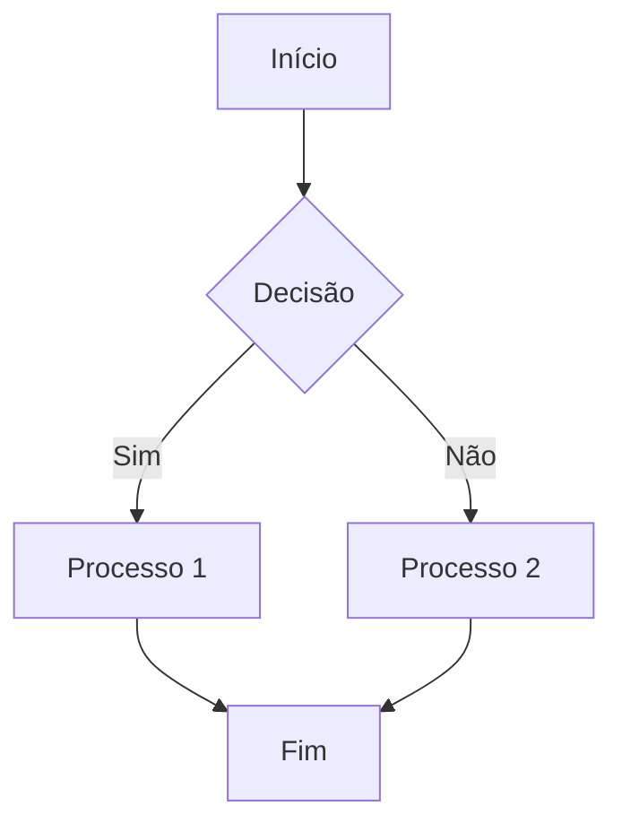
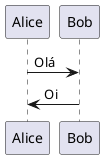

# Introdução à Terapia Sistêmica

A terapia sistêmica é uma abordagem que considera o indivíduo como parte de sistemas mais amplos, como a família, o trabalho e a sociedade. Diferente de abordagens que focam apenas no indivíduo isoladamente, a terapia sistêmica entende que somos seres relacionais e que nossos problemas e soluções estão frequentemente conectados às nossas relações.

## Princípios Fundamentais

1. **Circularidade**: Na visão sistêmica, as relações não são lineares (causa e efeito simples), mas circulares, onde cada pessoa influencia e é influenciada pelas outras.
2. **Contexto**: Os comportamentos só fazem sentido dentro de um contexto específico. O que parece "disfuncional" em um contexto pode ser adaptativo em outro.
3. **Padrões Relacionais**: Focamos em identificar padrões de interação que se repetem, em vez de apenas traços de personalidade individuais.

## Como a Terapia Sistêmica Pode Ajudar

A terapia sistêmica é particularmente eficaz para:
- Problemas de relacionamento (casais, famílias)
- Dificuldades de comunicação
- Transições de vida (casamento, nascimento de filhos, divórcio)
- Conflitos familiares recorrentes
- Questões que envolvem várias gerações

Ao adotar uma perspectiva sistêmica, conseguimos enxergar além do "problema" individual e compreender como as dinâmicas relacionais contribuem para os desafios que enfrentamos.

---

# O Guia Definitivo de Markdown

Este documento demonstra todos os recursos possíveis de formatação Markdown e suas extensões mais comuns.

## Formatação Básica de Texto

### Ênfase e Destaque

*Este texto está em itálico* ou _este também está em itálico_

**Este texto está em negrito** ou __este também está em negrito__

***Este texto está em negrito e itálico*** ou ___este também está em negrito e itálico___

~~Este texto está riscado~~

==Este texto está destacado== (em algumas implementações)

++Este texto está sublinhado++ (em algumas implementações)

### Citações (Blockquotes)

> Esta é uma citação simples.
>
> > Esta é uma citação dentro de outra citação.
> >
> > > E podemos continuar aninhando citações.

> #### Título dentro da citação
>
> - Lista dentro da citação
> - Outro item da lista
>
> *Texto em itálico* dentro da citação

### Listas

#### Lista Ordenada

1. Primeiro item
2. Segundo item
   1. Sub-item 2.1
   2. Sub-item 2.2
3. Terceiro item

#### Lista Não-Ordenada

- Item
- Outro item
  - Sub-item
  - Outro sub-item
- Mais um item

#### Lista de Tarefas

- [x] Tarefa concluída
- [ ] Tarefa pendente
- [ ] Outra tarefa pendente
- [x] Mais uma tarefa concluída

#### Lista de Definições (em algumas implementações)

Termo 1
: Definição do termo 1

Termo 2
: Definição do termo 2
: Outra definição do termo 2

## Código

### Código Inline

Use a função `print()` para exibir texto no console.

### Blocos de Código

```
Este é um bloco de código genérico.
Sem destaque de sintaxe.
```

#### Blocos de Código com Destaque de Sintaxe

```javascript
function saudacao(nome) {
  console.log(`Olá, ${nome}!`);
}

// Chamando a função
saudacao("Mundo");
```

```python
def fatorial(n):
    if n == 0 or n == 1:
        return 1
    else:
        return n * fatorial(n-1)
        
# Calculando o fatorial de 5
resultado = fatorial(5)
print(f"O fatorial de 5 é {resultado}")
```

```java
import org.springframework.boot.SpringApplication;
import org.springframework.boot.autoconfigure.SpringBootApplication;

@SpringBootApplication
public class Application {
    public static void main(String[] args) {
        SpringApplication.run(Application.class, args);
    }
}
```

```css
body {
  font-family: 'Arial', sans-serif;
  line-height: 1.6;
  color: #333;
  max-width: 650px;
  margin: 0 auto;
  padding: 20px;
}

.highlight {
  background-color: yellow;
  padding: 2px;
}
```

#### Código com Linha Destacada

```java {3,5-7}
public class Exemplo {
    public static void main(String[] args) {
        // Esta linha será destacada
        System.out.println("Olá Mundo!");
        // Este bloco
        // de linhas
        // será destacado
    }
}
```

## Links

### Links Simples

[Google](https://www.google.com)

[Google com Título](https://www.google.com "Clique para ir ao Google")

### Links de Referência

[Link de referência][ref1]

[Outro link][ref2]

[ref1]: https://www.example.com "Site de Exemplo"
[ref2]: https://www.example.org "Outro Site de Exemplo"

### Autolinks

<https://www.example.com>

<email@exemplo.com>

### Links Internos (Âncoras)

[Voltar ao topo](#introdução-à-terapia-sistêmica)

## Imagens

### Imagem Simples


### Imagem com Título


### Imagem Como Link

[](/assets/content/blog/images/terapia-sistemica.jpg)

### Imagem de Referência

![Texto Alternativo][imagem-id]

[imagem-id]: /assets/content/blog/images/terapia-sistemica.jpg "Título Opcional"

### Dimensionamento de Imagem (em algumas implementações)

{width=50% height=auto}

## Tabelas

### Tabela Simples

| Coluna 1 | Coluna 2 | Coluna 3 |
|----------|----------|----------|
| Linha 1, Col 1 | Linha 1, Col 2 | Linha 1, Col 3 |
| Linha 2, Col 1 | Linha 2, Col 2 | Linha 2, Col 3 |

### Tabela com Alinhamento
cado~
| Esquerda | Centro | Direita |
|:---------|:------:|--------:|
| Texto | Texto | Texto |
| Mais texto | Mais texto | Mais texto |

### Tabela Complexa

| Nome | Idade | Profissão | Salário |
|:-----|:-----:|-----------|--------:|
| João | 32 | Engenheiro | R$ 7.500,00 |
| Maria | 28 | **Desenvolvedora** | R$ 8.200,00 |
| Carlos | 45 | *Gestor* | R$ 10.500,00 |
| Ana | 37 | ~~Estagiária~~ Analista | R$ 5.800,00 |

## Linhas Horizontais

Três ou mais hífens:

---

Três ou mais asteriscos:

***

Três ou mais underscores:

___

## Notas de Rodapé

Aqui está um texto com uma nota de rodapé[^1].

E aqui está outra nota de rodapé[^nota].

[^1]: Esta é a primeira nota de rodapé.
[^nota]: Esta é uma nota de rodapé com um identificador.

## Abreviações (em algumas implementações)

*[HTML]: Hypertext Markup Language
*[CSS]: Cascading Style Sheets

Esta página foi criada usando HTML e CSS.

## Elementos HTML Embutidos

Markdown suporta a inclusão de <abbr title="Hypertext Markup Language">HTML</abbr> bruto.

<div style="padding: 20px; background-color: #f0f0f0; border-radius: 5px;">
  <h3>Este é um bloco HTML</h3>
  <p>Markdown <em>ainda funciona</em> dentro de elementos HTML.</p>
</div>

## Diagramas (com extensões específicas)

### Mermaid (em implementações compatíveis)



### PlantUML (em implementações compatíveis)



## Equações Matemáticas (com extensões LaTeX)

### Inline

Quando $a \ne 0$, existem duas soluções para $ax^2 + bx + c = 0$ e são dadas por $x = {-b \pm \sqrt{b^2-4ac} \over 2a}$.

### Bloco

$$
\begin{aligned}
\frac{\partial \mathcal{L}}{\partial \theta} &= \frac{1}{N} \sum_{i=1}^{N} \frac{\partial}{\partial \theta} \left[ \log P(y_i | x_i; \theta) \right] \\
&= \frac{1}{N} \sum_{i=1}^{N} \frac{1}{P(y_i | x_i; \theta)} \frac{\partial}{\partial \theta} P(y_i | x_i; \theta)
\end{aligned}
$$

## Detalhes (Expansíveis)

<details>
<summary>Clique para expandir</summary>

Este é o conteúdo oculto que aparece quando você clica no título.

Pode conter **formatação**, listas, e outros elementos Markdown:

1. Item um
2. Item dois
3. Item três

</details>

## Teclado

Pressione <kbd>Ctrl</kbd>+<kbd>C</kbd> para copiar o texto.

## Comentários (invisíveis na renderização)

[//]: # (Este é um comentário invisível na renderização)

<!---
Este é outro tipo de comentário que não aparece na renderização
-->

## Emojis (em algumas implementações)

:smile: :heart: :thumbsup: :rocket: :+1:

## Metadados YAML (Front Matter)

Os metadados no topo deste documento (entre os `---`) são chamados de "Front Matter" e são usados em várias plataformas para configurar aspectos do documento:

```yaml
---
title: Introdução à Terapia Sistêmica - Uma Abordagem Relacional
date: 2023-09-15
description: Entenda os princípios básicos da terapia sistêmica e como ela pode ajudar a melhorar seus relacionamentos.
image: terapia-sistemica.jpg
categories: 
  - Terapia Sistêmica
  - Relacionamentos
tags:
  - psicoterapia
  - saúde mental
  - relações familiares
author: Dr. Ana Silva
toc: true
draft: false
---
```

## Suporte a Vídeo (em alguns sistemas)


## Quebras de Linha

Aqui está uma linha.  
E aqui está outra linha (note os dois espaços após o ponto).

Aqui está um parágrafo.

E aqui está outro parágrafo (linha em branco entre eles).

## Caracteres Especiais Escapados

\* Asterisco sem formar itálico \*

\\ Barra invertida

\` Backtick (acento grave)

\_ Underscore sem formar itálico \_

\{ \} Chaves

\[ \] Colchetes

\( \) Parênteses

\# Hashtag sem formar título

\+ Sinal de mais

\- Hífen

\. Ponto

\! Exclamação

## Parâmetros de URL (em algumas implementações)

[Link com parâmetros](https://example.com/search?q=markdown&lang=pt-br)

## Admonições (em algumas implementações como Material for MkDocs)

!!! note "Nota"
    Esta é uma nota com um título personalizado.

!!! warning ""
    Esta é uma advertência sem título.

!!! danger "Perigo"
    Este é um aviso de perigo.
    
    Ele pode conter múltiplos parágrafos.

!!! info inline
    Esta informação aparece em linha com o texto ao redor.

!!! tip "Dica"
    Aqui está uma dica útil.

### Admonições Dobráveis

??? example "Exemplo expansível (clique para expandir)"
    Este é um exemplo que pode ser expandido clicando no título.

???+ note "Exemplo expansível (expandido por padrão)"
    Este exemplo está expandido por padrão.

## Atributos Personalizados (em algumas implementações)

### IDs Personalizados

#### Meu Título Especial {#id-personalizado}

[Link para o título acima](#id-personalizado)

### Classes Personalizadas

Texto com uma classe personalizada. {.classe-especial}

### Outros Atributos Personalizados

Texto com atributos personalizados. {data-toggle="modal" aria-label="Rótulo"}

## Transcrições (para acessibilidade)

<figure>
  
  <figcaption>Crescimento dos casos de terapia online durante a pandemia</figcaption>
</figure>

<audio controls>
  <source src="audio.mp3" type="audio/mpeg">
  <p>Seu navegador não suporta áudio HTML5. Aqui está <a href="audio.mp3">um link para o áudio</a>.</p>
</audio>

<video controls>
  <source src="video.mp4" type="video/mp4">
  <track kind="subtitles" src="legendas.vtt" srclang="pt" label="Português">
  <p>Seu navegador não suporta vídeo HTML5. Aqui está <a href="video.mp4">um link para o vídeo</a>.</p>
</video>

## Barra Lateral Personalizada (em algumas implementações)

[TOC]

## Citações Acadêmicas (em algumas implementações)

[@smith2020]

Smith et al. (2020) argumentam que... [@smith2020, p. 33]

## Sumário / Índice

Algumas implementações de Markdown permitem a geração automática de sumários:

- [Introdução à Terapia Sistêmica](#introdução-à-terapia-sistêmica)
  - [Princípios Fundamentais](#princípios-fundamentais)
  - [Como a Terapia Sistêmica Pode Ajudar](#como-a-terapia-sistêmica-pode-ajudar)
- [O Guia Definitivo de Markdown](#o-guia-definitivo-de-markdown)
  - [Formatação Básica de Texto](#formatação-básica-de-texto)
  - [Citações](#citações-blockquotes)
  - [Listas](#listas)
  - [Código](#código)

## Mapas Geográficos (em algumas implementações)

```geo
{
  "type": "FeatureCollection",
  "features": [
    {
      "type": "Feature",
      "properties": {},
      "geometry": {
        "type": "Point",
        "coordinates": [
          -46.633309,
          -23.550520
        ]
      }
    }
  ]
}
```

## Cronogramas (em algumas implementações)

```timeline
title História da Terapia Sistêmica
1950 : Surge a Terapia Familiar
  + Primeiros trabalhos com famílias
  + Influência da Teoria Geral dos Sistemas
1960 : Escola de Milão
  + Mara Selvini Palazzoli
  + Abordagem estratégica
1980 : Abordagem Narrativa
  + Michael White e David Epston
  + Foco nas histórias e significados
2000 : Expansão global
  + Integração com outras abordagens
  + Aplicações em diversos contextos
```

## Conclusão

Este documento abrange praticamente todos os recursos possíveis de Markdown e suas extensões mais comuns. É importante notar que nem todas as implementações de Markdown suportam todos esses recursos. Alguns são específicos de certas plataformas como GitHub, GitLab, Jekyll, Hugo, MkDocs, entre outros.

Para um documento compatível com o maior número de plataformas, recomenda-se ater-se à sintaxe básica do Markdown (conhecida como CommonMark) e verificar a documentação específica da plataforma para recursos avançados.

---

**Referências**:

- [CommonMark Spec](https://commonmark.org/)
- [GitHub Flavored Markdown](https://github.github.com/gfm/)
- [Markdown Guide](https://www.markdownguide.org/)
- [Pandoc's Markdown](https://pandoc.org/MANUAL.html#pandocs-markdown)
- [Material for MkDocs](https://squidfunk.github.io/mkdocs-material/reference/admonitions/)
